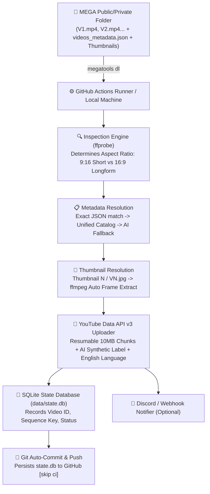

# YouTube Video Automation Engine — Autonomous Setup & Operations Guide (Antigravity Agent Blueprint)

> **Agent Directive:** This document is an end-to-end, deterministic specification for setting up and maintaining automated YouTube Shorts and Long-form channel pipelines using GitHub Actions, MEGA cloud storage, YouTube Data API v3, and SQLite state tracking. When executed by an AI agent (e.g., Antigravity, Cursor, Claude Engineer), the agent must follow this protocol step-by-step with zero manual code rewrite required.

---

## 1. System Architecture Overview



### Core Tenets:
1. **1 Channel = 1 GitHub Repository = 1 GCP Project:** Ensures complete quota independence, isolated rate limits, and risk compartmentalization.
2. **Deterministic Sequence Ingestion:** Uploads videos strictly in ascending order (`V1 -> V2 -> V3 -> ... -> VN`).
3. **Resilient Ephemeral State:** GitHub Actions runners download, process, upload, update SQLite `data/state.db`, commit the DB back to `main`, and wipe temporary video files from disk.
4. **YouTube Compliance:** Enforces `containsSyntheticMedia: true`, `defaultLanguage: "en"`, `defaultAudioLanguage: "en"`, and `selfDeclaredMadeForKids: false`.

---

## 2. Directory Structure Blueprint

Every new channel repository must implement this exact file layout:

```text
youtube-automation-channel/
├── .github/
│   └── workflows/
│       └── upload.yml             # GitHub Actions 2x daily schedule + runner wipe
├── credentials/
│   └── client_secret.json         # Google OAuth Desktop Client JSON (Git-ignored)
├── tokens/
│   └── oauth_token.json           # User OAuth Token with Refresh Token (Git-ignored)
├── data/
│   ├── state.db                   # SQLite database tracking uploaded videos (Committed)
│   └── videos_metadata.json       # Optional fallback metadata catalog (Committed)
├── downloads/                     # Ephemeral directory for downloaded videos (Git-ignored)
├── logs/                          # Run logs (Git-ignored)
├── src/
│   ├── __init__.py
│   ├── config.py                  # YAML loader with strong typing
│   ├── db.py                      # SQLite manager with ACID transactions
│   ├── mega_manager.py            # MEGA downloader, sequence parser, catalog loader
│   ├── drive_manager.py           # Google Drive alternate downloader
│   ├── notifier.py                # Discord webhook embed alerts
│   ├── video_utils.py             # ffprobe aspect ratio & audio inspector
│   └── youtube_uploader.py        # Resumable chunked uploader with AI tags
├── auth_setup.py                  # Local one-time OAuth server with auto-browser launch
├── config.yaml                    # Channel-specific configuration
├── requirements.txt               # Python package dependencies
└── run.py                         # Master orchestration CLI (--force-video, --slot, --dry-run)
```

---

## 3. Dependency Specification (`requirements.txt`)

```text
google-api-python-client>=2.100.0
google-auth-httplib2>=0.1.1
google-auth-oauthlib>=1.1.0
pyyaml>=6.0
python-dotenv>=1.0.0
requests>=2.31.0
```

### System Binary Requirements:
* `ffmpeg` (for video inspection and auto-thumbnail extraction)
* `megatools` (for downloading from MEGA storage)
* `python` >= 3.10

---

## 4. Configuration Schema (`config.yaml`)

```yaml
# Channel & Pipeline Configuration

channel:
  id: "karma_stories"
  name: "Karma Stories"
  owner_email: "arahad7861412@gmail.com"

# Cloud Storage Source ("mega" or "gdrive")
storage_source: "mega"

mega:
  folder_url: "https://mega.nz/folder/PORWABra#E-VBniVbBUGN6bXohdDL5Q"

google_drive:
  folder_id: ""
  service_account_file: "credentials/gdrive_service_account.json"

youtube:
  client_secret_file: "credentials/client_secret.json"
  oauth_token_file: "tokens/oauth_token.json"
  default_category_id: "24"          # 24: Entertainment, 22: People & Blogs
  default_privacy_status: "public"    # public, unlisted, private
  default_made_for_kids: false
  shorts_max_seconds: 180
  description_footer: "\n\n🔔 Subscribe for daily stories of Truth, Karma & Respect!\n\n#Shorts #Karma #Respect #Motivation #LifeLessons"

settings:
  database_file: "data/state.db"
  downloads_dir: "downloads"
  logs_dir: "logs"
  auto_generate_metadata: true
  auto_generate_thumbnail: true
```

---

## 5. Implementation Codebase

### A. Database Manager (`src/db.py`)

```python
import sqlite3
from pathlib import Path
from datetime import datetime, timezone
from typing import Optional, Set, Dict, Any, List
from contextlib import contextmanager

class Database:
    def __init__(self, db_path: str = "data/state.db"):
        self.db_path = Path(db_path)
        self.db_path.parent.mkdir(parents=True, exist_ok=True)
        self._init_db()

    @contextmanager
    def _get_connection(self):
        conn = sqlite3.connect(self.db_path)
        conn.row_factory = sqlite3.Row
        try:
            yield conn
        finally:
            conn.close()

    def _init_db(self):
        with self._get_connection() as conn:
            cursor = conn.cursor()
            cursor.execute("""
                CREATE TABLE IF NOT EXISTS uploaded_videos (
                    sequence_key TEXT PRIMARY KEY,
                    sequence_num INTEGER,
                    youtube_id TEXT,
                    youtube_url TEXT,
                    title TEXT,
                    video_type TEXT,
                    has_thumbnail INTEGER DEFAULT 0,
                    uploaded_at TIMESTAMP DEFAULT CURRENT_TIMESTAMP,
                    status TEXT NOT NULL
                )
            """)
            cursor.execute("""
                CREATE TABLE IF NOT EXISTS runs (
                    id INTEGER PRIMARY KEY AUTOINCREMENT,
                    run_date TEXT NOT NULL,
                    slot TEXT,
                    sequence_key TEXT,
                    status TEXT NOT NULL,
                    message TEXT,
                    timestamp TIMESTAMP DEFAULT CURRENT_TIMESTAMP
                )
            """)
            conn.commit()

    def get_uploaded_sequence_keys(self) -> Set[str]:
        with self._get_connection() as conn:
            cursor = conn.cursor()
            cursor.execute("SELECT sequence_key FROM uploaded_videos WHERE status = 'uploaded'")
            return {row["sequence_key"] for row in cursor.fetchall()}

    def record_upload(self, sequence_key: str, sequence_num: int, youtube_id: str, youtube_url: str, title: str, video_type: str, has_thumbnail: bool, status: str = "uploaded"):
        with self._get_connection() as conn:
            cursor = conn.cursor()
            cursor.execute("""
                INSERT OR REPLACE INTO uploaded_videos 
                (sequence_key, sequence_num, youtube_id, youtube_url, title, video_type, has_thumbnail, uploaded_at, status)
                VALUES (?, ?, ?, ?, ?, ?, ?, ?, ?)
            """, (
                sequence_key,
                sequence_num,
                youtube_id,
                youtube_url,
                title,
                video_type,
                1 if has_thumbnail else 0,
                datetime.now(timezone.utc).isoformat(),
                status
            ))
            conn.commit()

    def slot_already_ran_today(self, run_date: str, slot: str) -> bool:
        if not slot:
            return False
        with self._get_connection() as conn:
            cursor = conn.cursor()
            cursor.execute("SELECT 1 FROM runs WHERE run_date = ? AND slot = ? AND status = 'success' LIMIT 1", (run_date, slot))
            return cursor.fetchone() is not None

    def record_run(self, run_date: str, slot: Optional[str], sequence_key: Optional[str], status: str, message: Optional[str] = None):
        with self._get_connection() as conn:
            cursor = conn.cursor()
            cursor.execute("INSERT INTO runs (run_date, slot, sequence_key, status, message) VALUES (?, ?, ?, ?, ?)", (run_date, slot, sequence_key, status, message))
            conn.commit()
```

---

### B. Video Inspection Utility (`src/video_utils.py`)

```python
import json
import subprocess
from dataclasses import dataclass
from pathlib import Path

@dataclass
class VideoInfo:
    duration: float
    width: int
    height: int
    has_audio: bool
    is_vertical: bool

    @property
    def is_short(self) -> bool:
        # YouTube Shorts criteria: vertical or square and <= 180 seconds
        return self.is_vertical and self.duration <= 180.0

def inspect_video(video_path: Path) -> VideoInfo:
    cmd = [
        "ffprobe",
        "-v", "quiet",
        "-print_format", "json",
        "-show_format",
        "-show_streams",
        str(video_path)
    ]
    result = subprocess.run(cmd, stdout=subprocess.PIPE, stderr=subprocess.PIPE, text=True, check=True)
    data = json.loads(result.stdout)

    video_stream = next((s for s in data.get("streams", []) if s.get("codec_type") == "video"), None)
    audio_stream = next((s for s in data.get("streams", []) if s.get("codec_type") == "audio"), None)

    if not video_stream:
        raise ValueError(f"No video stream found in {video_path}")

    width = int(video_stream.get("width", 0))
    height = int(video_stream.get("height", 0))
    duration = float(data.get("format", {}).get("duration", video_stream.get("duration", 0.0)))
    has_audio = audio_stream is not None
    is_vertical = height >= width

    return VideoInfo(
        duration=duration,
        width=width,
        height=height,
        has_audio=has_audio,
        is_vertical=is_vertical
    )
```

---

### C. MEGA Ingestion & Catalog Manager (`src/mega_manager.py`)

```python
import os
import re
import json
import logging
import subprocess
import shutil
from pathlib import Path
from typing import Dict, List, Optional, Any
from src.video_utils import inspect_video

logger = logging.getLogger(__name__)

VIDEO_EXTENSIONS = {".mp4", ".mov", ".mkv", ".webm", ".avi", ".m4v"}
METADATA_EXTENSIONS = {".json"}
THUMBNAIL_EXTENSIONS = {".jpg", ".jpeg", ".png", ".webp"}

class MegaSequenceItem:
    def __init__(
        self,
        sequence_num: int,
        sequence_key: str,
        video_path: Optional[Path] = None,
        json_path: Optional[Path] = None,
        thumbnail_path: Optional[Path] = None,
        catalog_metadata: Optional[Dict[str, Any]] = None
    ):
        self.sequence_num = sequence_num
        self.sequence_key = sequence_key  # e.g. "V1"
        self.video_path = video_path
        self.json_path = json_path
        self.thumbnail_path = thumbnail_path
        self.catalog_metadata = catalog_metadata

    @property
    def has_video(self) -> bool:
        return self.video_path is not None and self.video_path.exists()

    @property
    def has_metadata(self) -> bool:
        return (self.json_path is not None and self.json_path.exists()) or (self.catalog_metadata is not None)

    @property
    def has_thumbnail(self) -> bool:
        return self.thumbnail_path is not None and self.thumbnail_path.exists()


class MegaManager:
    def __init__(self, mega_folder_url: str, downloads_dir: str = "downloads"):
        self.mega_folder_url = mega_folder_url
        self.downloads_dir = Path(downloads_dir)
        self.downloads_dir.mkdir(parents=True, exist_ok=True)

    def _get_megatools_bin(self) -> str:
        if shutil.which("megatools"):
            return "megatools"
        if Path("/opt/homebrew/bin/megatools").exists():
            return "/opt/homebrew/bin/megatools"
        if Path("/usr/bin/megatools").exists():
            return "/usr/bin/megatools"
        return "megatools"

    def download_folder_contents(self) -> Path:
        logger.info(f"Downloading files from MEGA folder: {self.mega_folder_url}...")
        megatools_bin = self._get_megatools_bin()
        cmd = [
            megatools_bin,
            "dl",
            "--no-progress",
            "--print-names",
            f"--path={self.downloads_dir}",
            self.mega_folder_url
        ]
        try:
            result = subprocess.run(cmd, stdout=subprocess.PIPE, stderr=subprocess.PIPE, text=True, check=True)
            logger.info(f"megatools output:\n{result.stdout}")
        except subprocess.CalledProcessError as e:
            logger.error(f"megatools dl failed: {e.stderr}")
            if not any(self.downloads_dir.iterdir()):
                raise RuntimeError(f"Failed to download from MEGA folder: {e.stderr}")
        return self.downloads_dir

    def _extract_sequence_number(self, filename: str) -> Optional[int]:
        stem = Path(filename).stem
        match = re.search(r"^(?:video|v|thumbnail|thumb|t)?[\s_-]*(\d+)", stem, re.IGNORECASE)
        if match:
            return int(match.group(1))
        return None

    def load_unified_catalog(self) -> Dict[str, Dict[str, Any]]:
        catalog: Dict[str, Dict[str, Any]] = {}
        possible_paths = [
            self.downloads_dir / "videos_metadata.json",
            Path("data/videos_metadata.json"),
        ]
        if self.downloads_dir.exists():
            for p in self.downloads_dir.rglob("*metadata*.json"):
                possible_paths.append(p)

        for cat_path in possible_paths:
            if cat_path.exists():
                try:
                    with open(cat_path, "r", encoding="utf-8") as f:
                        data = json.load(f)
                        if isinstance(data, list):
                            for entry in data:
                                key = entry.get("video_number") or entry.get("video_file")
                                if key:
                                    stem = Path(key).stem.upper()
                                    catalog[stem] = entry
                            logger.info(f"Loaded {len(catalog)} metadata entries from {cat_path}")
                            break
                except Exception as e:
                    logger.warning(f"Failed to parse catalog metadata from {cat_path}: {e}")
        return catalog

    def scan_sequence_items(self) -> Dict[int, MegaSequenceItem]:
        items: Dict[int, MegaSequenceItem] = {}
        catalog = self.load_unified_catalog()

        for file_path in self.downloads_dir.rglob("*"):
            if not file_path.is_file() or file_path.name.startswith("."):
                continue

            name = file_path.name
            ext = file_path.suffix.lower()
            seq_num = self._extract_sequence_number(name)
            if seq_num is None:
                continue

            seq_key = f"V{seq_num}"
            if seq_num not in items:
                items[seq_num] = MegaSequenceItem(
                    sequence_num=seq_num,
                    sequence_key=seq_key,
                    catalog_metadata=catalog.get(seq_key.upper())
                )

            item = items[seq_num]
            if not item.catalog_metadata and seq_key.upper() in catalog:
                item.catalog_metadata = catalog[seq_key.upper()]

            if ext in VIDEO_EXTENSIONS:
                item.video_path = file_path
            elif ext in METADATA_EXTENSIONS:
                item.json_path = file_path
            elif ext in THUMBNAIL_EXTENSIONS:
                item.thumbnail_path = file_path

        return dict(sorted(items.items()))

    def get_next_unposted_item(self, uploaded_keys: set) -> Optional[MegaSequenceItem]:
        items = self.scan_sequence_items()
        for seq_num in sorted(items.keys()):
            item = items[seq_num]
            if item.sequence_key not in uploaded_keys:
                if not item.has_video:
                    logger.warning(f"{item.sequence_key} has no video file found! Skipping.")
                    continue
                return item
        return None

    def generate_auto_metadata(self, sequence_key: str, seq_num: int, is_short: bool) -> Dict[str, Any]:
        if is_short:
            title = f"Story #{seq_num} | The Echo of Karma #Shorts"
            description = (
                f"Watch how arrogance meets humility and truth rises.\n"
                f"Episode {seq_num} of the drama series.\n\n"
                f"🔔 Subscribe for daily moral stories and life lessons!\n\n"
                f"#Shorts #Karma #Respect #Motivation #LifeLessons #Storytelling"
            )
        else:
            title = f"Karma Stories — Episode {seq_num} [Full 4K Short Film]"
            description = (
                f"Experience a powerful drama about respect and instant karma.\n\n"
                f"Episode {seq_num} — Watch in high definition.\n\n"
                f"👍 Like and Subscribe to support the channel!\n\n"
                f"#Karma #LifeLessons #Drama #ShortFilm #Respect"
            )

        return {
            "title": title,
            "description": description,
            "tags": ["Shorts", "Karma", "Respect", "LifeLessons", "Motivation", "Storytelling", "Viral"],
            "categoryId": "24",
            "privacyStatus": "public",
            "isShort": is_short,
            "madeForKids": False
        }

    def extract_auto_thumbnail(self, video_path: Path, output_thumb_path: Path) -> Path:
        output_thumb_path.parent.mkdir(parents=True, exist_ok=True)
        info = inspect_video(video_path)
        timestamp = max(1.0, info.duration * 0.2)
        cmd = [
            "ffmpeg", "-y",
            "-ss", str(timestamp),
            "-i", str(video_path),
            "-vframes", "1",
            "-q:v", "2",
            str(output_thumb_path)
        ]
        subprocess.run(cmd, stdout=subprocess.PIPE, stderr=subprocess.PIPE, check=True)
        return output_thumb_path
```

---

### D. YouTube Uploader with Compliance Tags (`src/youtube_uploader.py`)

```python
import os
import time
import logging
from pathlib import Path
from typing import Dict, Any, Optional
from googleapiclient.discovery import build
from googleapiclient.http import MediaFileUpload
from googleapiclient.errors import HttpError
from google.oauth2.credentials import Credentials
from google.auth.transport.requests import Request

logger = logging.getLogger(__name__)

YOUTUBE_UPLOAD_SCOPE = "https://www.googleapis.com/auth/youtube.upload"

class YouTubeUploader:
    def __init__(
        self,
        client_secret_file: str = "credentials/client_secret.json",
        oauth_token_file: str = "tokens/oauth_token.json"
    ):
        self.client_secret_file = client_secret_file
        self.oauth_token_file = oauth_token_file
        self.youtube = self._authenticate()

    def _authenticate(self):
        if not os.path.exists(self.oauth_token_file):
            raise FileNotFoundError(f"OAuth token file not found at: {self.oauth_token_file}")

        creds = Credentials.from_authorized_user_file(self.oauth_token_file, scopes=[YOUTUBE_UPLOAD_SCOPE])
        if creds.expired and creds.refresh_token:
            logger.info("OAuth token expired. Refreshing...")
            creds.refresh(Request())
            Path(self.oauth_token_file).parent.mkdir(parents=True, exist_ok=True)
            with open(self.oauth_token_file, "w", encoding="utf-8") as token_f:
                token_f.write(creds.to_json())
            logger.info("OAuth token successfully refreshed and saved.")

        return build("youtube", "v3", credentials=creds)

    def upload_video(
        self,
        video_path: Path,
        metadata: Dict[str, Any],
        is_short: bool = False,
        description_footer: str = ""
    ) -> Dict[str, Any]:
        title = metadata.get("title", video_path.stem)
        description = metadata.get("description", "")
        if description_footer:
            description = f"{description}\n{description_footer}".strip()

        tags = metadata.get("tags", [])
        if is_short:
            if "Shorts" not in tags and "shorts" not in tags:
                tags.append("Shorts")
            if "#shorts" not in description.lower():
                description += "\n\n#shorts"

        category_id = str(metadata.get("categoryId", "24"))
        privacy_status = metadata.get("privacyStatus", "public")
        made_for_kids = bool(metadata.get("madeForKids", False))

        body = {
            "snippet": {
                "title": title[:100],
                "description": description[:5000],
                "tags": tags,
                "categoryId": category_id,
                "defaultLanguage": "en",
                "defaultAudioLanguage": "en"
            },
            "status": {
                "privacyStatus": privacy_status,
                "selfDeclaredMadeForKids": made_for_kids,
                "containsSyntheticMedia": True  # AI-generated content disclosure
            }
        }

        logger.info(f"Initiating upload for video: '{title}' (Type: {'Short' if is_short else 'Long-form'})...")
        logger.info("AI-generated content label: ENABLED ✅ | Language: English (en) ✅ | Not made for kids: True ✅")

        media = MediaFileUpload(
            str(video_path),
            chunksize=1024 * 1024 * 10,  # 10MB chunk
            resumable=True
        )

        request = self.youtube.videos().insert(
            part="snippet,status",
            body=body,
            media_body=media
        )

        response = None
        retry_count = 0
        max_retries = 5

        while response is None:
            try:
                status, response = request.next_chunk()
                if status:
                    logger.info(f"Upload progress: {int(status.progress() * 100)}%")
            except HttpError as e:
                if e.resp.status in [500, 502, 503, 504]:
                    retry_count += 1
                    if retry_count > max_retries:
                        raise
                    time.sleep(2 ** retry_count)
                else:
                    raise

        video_id = response.get("id")
        video_url = f"https://youtu.be/{video_id}"
        logger.info(f"Video successfully uploaded! ID: {video_id} -> {video_url}")

        return {
            "id": video_id,
            "url": video_url,
            "title": title,
            "response": response
        }

    def set_thumbnail(self, video_id: str, thumbnail_path: Path) -> bool:
        if not thumbnail_path.exists():
            return False
        logger.info(f"Setting custom thumbnail for video {video_id} from {thumbnail_path}...")
        media = MediaFileUpload(str(thumbnail_path), mimetype="image/jpeg", resumable=True)
        try:
            self.youtube.thumbnails().set(videoId=video_id, media_body=media).execute()
            logger.info(f"Custom thumbnail successfully set for video {video_id}!")
            return True
        except Exception as e:
            logger.warning(f"Failed to set custom thumbnail: {e}")
            return False
```

---

### E. Master Orchestrator CLI (`run.py`)

```python
import os
import sys
import json
import logging
import argparse
import shutil
from datetime import datetime, timezone
from pathlib import Path

from src.config import Config
from src.db import Database
from src.video_utils import inspect_video
from src.youtube_uploader import YouTubeUploader
from src.mega_manager import MegaManager
from src.notifier import Notifier

logging.basicConfig(
    level=logging.INFO,
    format="%(asctime)s [%(levelname)s] %(name)s: %(message)s",
    handlers=[logging.StreamHandler(sys.stdout)]
)
logger = logging.getLogger("pipeline")

def parse_args():
    parser = argparse.ArgumentParser(description="YouTube Sequential Video Automation Pipeline")
    parser.add_argument("--config", default="config.yaml", help="Path to configuration file")
    parser.add_argument("--dry-run", action="store_true", help="Simulate pipeline without uploading")
    parser.add_argument("--slot", default=None, help="Slot name for scheduling (e.g. slot1_8pm, slot2_11pm)")
    parser.add_argument("--force-video", default=None, help="Force specific video sequence (e.g. V1, V2)")
    return parser.parse_args()

def main():
    args = parse_args()
    config = Config.load(args.config)
    db = Database(config.database_file)
    notifier = Notifier(os.environ.get("DISCORD_WEBHOOK_URL", ""))

    today_str = datetime.now(timezone.utc).strftime("%Y-%m-%d")
    logger.info("=== Starting YouTube Video Automation Pipeline ===")

    # 1. Guard against duplicate slot runs on the same day
    if args.slot and not args.dry_run:
        if db.slot_already_ran_today(today_str, args.slot):
            logger.info(f"Slot '{args.slot}' has already executed successfully today ({today_str}). Exiting.")
            sys.exit(0)

    uploaded_keys = db.get_uploaded_sequence_keys()
    logger.info(f"Previously uploaded videos ({len(uploaded_keys)}): {sorted(list(uploaded_keys))}")

    # 2. Ingest Videos from Source
    mega_manager = None
    if config.storage_source == "mega":
        logger.info(f"Storage source: MEGA ({config.mega_folder_url})")
        mega_manager = MegaManager(config.mega_folder_url, config.downloads_dir)
        target_forced_file = Path(config.downloads_dir) / f"{args.force_video}.mp4" if args.force_video else None
        if target_forced_file and target_forced_file.exists():
            logger.info(f"Target video {target_forced_file.name} is already present in downloads/. Skipping re-download.")
        else:
            try:
                mega_manager.download_folder_contents()
            except Exception as e:
                err_msg = f"Failed to download from MEGA: {e}"
                logger.error(err_msg)
                db.record_run(today_str, args.slot, None, "failed", err_msg)
                sys.exit(1)

        items = mega_manager.scan_sequence_items()
        if args.force_video:
            seq_num_str = "".join(c for c in args.force_video if c.isdigit())
            seq_num = int(seq_num_str) if seq_num_str else 1
            target_item = items.get(seq_num)
        else:
            target_item = mega_manager.get_next_unposted_item(uploaded_keys)

        if not target_item:
            logger.info("🎉 No pending videos left to upload on MEGA! All caught up.")
            db.record_run(today_str, args.slot, None, "skipped", "No new videos available")
            sys.exit(0)

        sequence_key = target_item.sequence_key
        sequence_num = target_item.sequence_num
        target_video_path = target_item.video_path
        target_json_path = target_item.json_path
        target_thumb_path = target_item.thumbnail_path

    logger.info(f"🎯 Target video selected: {sequence_key} ({target_video_path})")

    try:
        # 3. Inspect video properties
        video_info = inspect_video(target_video_path)
        logger.info(f"Video inspection: <VideoInfo duration={video_info.duration:.1f}s, resolution={video_info.width}x{video_info.height}, has_audio={video_info.has_audio}, is_vertical={video_info.is_vertical}>")
        is_short = video_info.is_short
        video_type_str = "short" if is_short else "longform"
        logger.info(f"Video format classified as: {video_type_str.upper()}")

        # 4. Resolve Metadata (File, Catalog, or Auto-Generated)
        metadata = None
        if target_json_path and target_json_path.exists():
            logger.info(f"Loading metadata from individual JSON file: {target_json_path}")
            with open(target_json_path, "r", encoding="utf-8") as f:
                metadata = json.load(f)
        elif hasattr(target_item, "catalog_metadata") and target_item.catalog_metadata:
            cat = target_item.catalog_metadata
            raw_title = cat.get("title", f"Part {sequence_num}")
            desc = cat.get("description", "")
            
            if is_short and not raw_title.lower().endswith("#shorts"):
                final_title = f"{raw_title} #Shorts"
            else:
                final_title = raw_title

            hashtags = [w.strip("#.,!?").strip() for w in desc.split() if w.startswith("#") and len(w) > 1]
            tags = list(dict.fromkeys(hashtags + ["Shorts", "Motivation", "Respect", "Story", "Viral"]))

            logger.info(f"Using exact catalog metadata for {sequence_key}: '{final_title}'")
            metadata = {
                "title": final_title,
                "description": desc,
                "tags": tags[:15],
                "categoryId": config.default_category_id,
                "privacyStatus": config.default_privacy_status,
                "isShort": is_short,
                "madeForKids": False
            }
        elif config.auto_generate_metadata:
            logger.info(f"Auto-generating metadata for {sequence_key} (Episode {sequence_num})...")
            metadata = mega_manager.generate_auto_metadata(sequence_key, sequence_num, is_short)
        else:
            raise ValueError(f"No metadata found for {sequence_key} and auto-generation is disabled.")

        # 5. Resolve Custom Thumbnail
        if not is_short:
            if not target_thumb_path or not target_thumb_path.exists():
                if config.auto_generate_thumbnail and mega_manager:
                    auto_thumb_path = target_video_path.parent / f"{sequence_key}_auto_thumb.jpg"
                    target_thumb_path = mega_manager.extract_auto_thumbnail(target_video_path, auto_thumb_path)
        else:
            if target_thumb_path and target_thumb_path.exists():
                logger.info(f"Custom thumbnail found for Short: {target_thumb_path.name}")
            else:
                logger.info("No custom thumbnail for Short. YouTube will generate default.")

        # 6. Dry Run Check
        if args.dry_run:
            logger.info("--- [DRY RUN SUMMARY] ---")
            logger.info(f"Sequence Key: {sequence_key}")
            logger.info(f"Video File: {target_video_path.name} ({target_video_path.stat().st_size / (1024*1024):.2f} MB)")
            logger.info(f"Video Type: {video_type_str}")
            logger.info(f"Title: {metadata.get('title')}")
            logger.info("--- Dry run completed successfully. No YouTube upload performed. ---")
            sys.exit(0)

        # 7. Upload to YouTube
        uploader = YouTubeUploader(
            client_secret_file=config.youtube_client_secret_file,
            oauth_token_file=config.youtube_oauth_token_file
        )

        upload_result = uploader.upload_video(
            video_path=target_video_path,
            metadata=metadata,
            is_short=is_short,
            description_footer=config.description_footer
        )

        # Upload thumbnail if available
        has_thumb_uploaded = False
        if target_thumb_path and target_thumb_path.exists():
            has_thumb_uploaded = uploader.set_thumbnail(upload_result["id"], target_thumb_path)

        # 8. Update Database State
        db.record_upload(
            sequence_key=sequence_key,
            sequence_num=sequence_num,
            youtube_id=upload_result["id"],
            youtube_url=upload_result["url"],
            title=upload_result["title"],
            video_type=video_type_str,
            has_thumbnail=has_thumb_uploaded,
            status="uploaded"
        )

        db.record_run(
            run_date=today_str,
            slot=args.slot,
            sequence_key=sequence_key,
            status="success",
            message=f"Uploaded to {upload_result['url']}"
        )

        logger.info(f"✅ Finished upload workflow for {sequence_key}: {upload_result['url']}")

    except Exception as e:
        err_msg = f"Upload pipeline failed for {sequence_key}: {e}"
        logger.exception(err_msg)
        db.record_run(today_str, args.slot, sequence_key, "failed", str(e))
        sys.exit(1)
    finally:
        # Clean up temporary downloads
        downloads_dir = Path(config.downloads_dir)
        if downloads_dir.exists():
            for item in downloads_dir.iterdir():
                try:
                    if item.is_file():
                        item.unlink()
                    elif item.is_dir():
                        shutil.rmtree(item, ignore_errors=True)
                except Exception:
                    pass

if __name__ == "__main__":
    main()
```

---

## 6. GitHub Actions Workflow Blueprint (`.github/workflows/upload.yml`)

```yaml
name: YouTube Sequential Uploader

on:
  schedule:
    # Slot 1: Starts at 7:50 PM PKT (14:50 UTC) for 8:00 PM PKT publication
    - cron: '50 14 * * *'
    # Slot 2: Starts at 10:50 PM PKT (17:50 UTC) for 11:00 PM PKT publication
    - cron: '50 17 * * *'

  workflow_dispatch:
    inputs:
      slot:
        description: 'Slot identifier (slot1 = 7:50PM PKT / 8PM slot, slot2 = 10:50PM PKT / 11PM slot)'
        required: false
        default: 'slot1'
      dry_run:
        description: 'Dry run (simulate without uploading to YouTube)'
        type: boolean
        required: false
        default: false
      force_video:
        description: 'Force specific video sequence (e.g. V1, V2)'
        required: false
        default: ''

concurrency:
  group: youtube-upload-${{ github.event.schedule || github.event.inputs.slot }}
  cancel-in-progress: false

jobs:
  upload:
    runs-on: ubuntu-latest
    permissions:
      contents: write

    steps:
      - name: Checkout Repository
        uses: actions/checkout@v4
        with:
          fetch-depth: 0

      - name: Set up Python
        uses: actions/setup-python@v5
        with:
          python-version: '3.11'
          cache: 'pip'

      - name: Install System Dependencies (ffmpeg & megatools)
        run: |
          sudo apt-get update
          sudo apt-get install -y ffmpeg megatools

      - name: Install Python Dependencies
        run: |
          pip install --upgrade pip
          pip install -r requirements.txt

      - name: Restore Credentials from Secrets
        env:
          YOUTUBE_CLIENT_SECRET_B64: ${{ secrets.YOUTUBE_CLIENT_SECRET_B64 }}
          YOUTUBE_OAUTH_TOKEN_B64: ${{ secrets.YOUTUBE_OAUTH_TOKEN_B64 }}
        run: |
          mkdir -p credentials tokens data logs downloads
          
          if [ -n "$YOUTUBE_CLIENT_SECRET_B64" ]; then
            echo "$YOUTUBE_CLIENT_SECRET_B64" | base64 -d > credentials/client_secret.json
          fi
          
          if [ -n "$YOUTUBE_OAUTH_TOKEN_B64" ]; then
            echo "$YOUTUBE_OAUTH_TOKEN_B64" | base64 -d > tokens/oauth_token.json
          fi

      - name: Determine Slot from Schedule
        id: slot_detect
        run: |
          if [ -n "${{ github.event.inputs.slot }}" ]; then
            echo "SLOT=${{ github.event.inputs.slot }}" >> $GITHUB_ENV
          elif [ "${{ github.event.schedule }}" = "50 14 * * *" ]; then
            echo "SLOT=slot1_8pm" >> $GITHUB_ENV
          elif [ "${{ github.event.schedule }}" = "50 17 * * *" ]; then
            echo "SLOT=slot2_11pm" >> $GITHUB_ENV
          else
            echo "SLOT=slot1" >> $GITHUB_ENV
          fi
          echo "Detected slot: $SLOT"

      - name: Run Sequential Uploader
        env:
          DISCORD_WEBHOOK_URL: ${{ secrets.DISCORD_WEBHOOK_URL }}
          MEGA_FOLDER_URL: ${{ secrets.MEGA_FOLDER_URL }}
        run: |
          CMD="python run.py --slot $SLOT"
          
          if [ "${{ github.event.inputs.dry_run }}" = "true" ]; then
            CMD="$CMD --dry-run"
          fi
          
          if [ -n "${{ github.event.inputs.force_video }}" ]; then
            CMD="$CMD --force-video ${{ github.event.inputs.force_video }}"
          fi
          
          echo "Executing: $CMD"
          $CMD

      - name: Commit and Push Updated State Database
        if: always() && github.event.inputs.dry_run != 'true'
        run: |
          git config --global user.name "github-actions[bot]"
          git config --global user.email "github-actions[bot]@users.noreply.github.com"
          
          if [ -f "data/state.db" ]; then
            git add data/state.db
            if ! git diff-index --quiet HEAD --; then
              git commit -m "Update upload state DB [$SLOT] [skip ci]"
              for i in 1 2 3; do
                git pull --rebase origin main && git push origin main && break || sleep 5
              done
            else
              echo "No state database changes to commit."
            fi
          fi

      - name: Upload Run Logs Artifact
        if: always()
        uses: actions/upload-artifact@v4
        with:
          name: upload-logs-${{ env.SLOT }}
          path: logs/
          retention-days: 14

      - name: Wipe Temporary Videos & Credentials from Runner
        if: always()
        run: |
          rm -rf downloads/* temp/* credentials/* tokens/*
          echo "Server space wiped and 100% clean."
```

---

## 7. Zero-Friction Setup Instructions (For New Laptops / Agents)

When an agent is given this markdown file to set up a brand new channel on any laptop:

### Step 1: Clone Repository & Create Virtual Environment
```bash
git clone https://github.com/<YOUR_GITHUB_USER>/<NEW_CHANNEL_REPO>.git
cd <NEW_CHANNEL_REPO>
python3 -m venv .venv
source .venv/bin/activate
pip install -r requirements.txt
```

### Step 2: Configure `config.yaml`
Set `channel.owner_email` and `mega.folder_url`.

### Step 3: Authenticate YouTube Channel (1-Time)
1. Ensure the user's email is in **Google Cloud Console ➔ OAuth Consent Screen ➔ Test Users**.
2. Run the local OAuth server:
   ```bash
   python auth_setup.py
   ```
3. The browser opens automatically $\rightarrow$ Choose Gmail account $\rightarrow$ Advanced $\rightarrow$ Allow.
4. Tokens are saved in `tokens/oauth_token.json` and base64 secrets are automatically configured in GitHub Actions via `gh secret set`.

### Step 4: Test Upload Execution
```bash
# Test dry-run
python run.py --dry-run

# Test live upload for V1
python run.py --force-video V1
```

### Step 5: Enable GitHub Actions Cron
The GitHub Actions workflow will automatically run every day at **7:50 PM PKT** and **10:50 PM PKT**, pulling unposted videos, matching metadata JSON and thumbnails, publishing to YouTube, and syncing the database!
